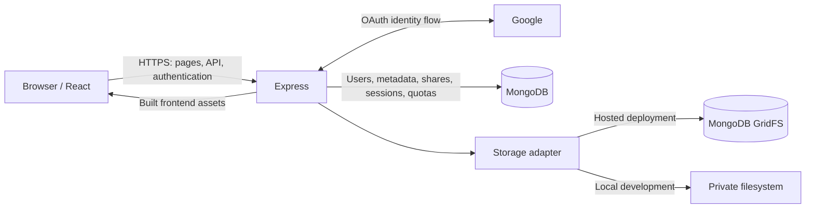
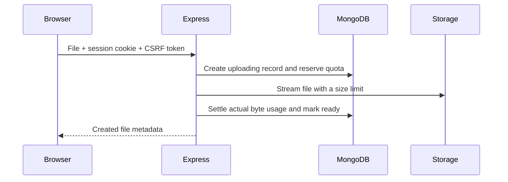

# Drive

**A personal file workspace for uploading, finding, previewing, and sharing your files.**

Drive brings a familiar file-management experience to a small, self-hostable application. Sign in with Google, keep files private, and give other users read-only access when you need to share. The interface is inspired by Google Drive; the application manages its own storage and never accesses your Google Drive files.

[**Open the live app**](https://google-drive-app-1ses.onrender.com) · [Architecture](docs/ARCHITECTURE.md) · [API reference](docs/API.md) · [Deployment guide](docs/DEPLOYMENT.md) · [Security](docs/SECURITY.md)

[](https://github.com/ayushgundecha/google-drive-app/actions/workflows/ci.yml)


_Desktop workspace with example files. The application also supports a [mobile layout](docs/screenshots/drive-mobile.png)._

> **Visiting the live app:** Render's free service sleeps after 15 minutes without incoming traffic. The first visit after inactivity can take about a minute to wake it up. Uploaded files remain in MongoDB Atlas. See [Render's free-service documentation](https://render.com/docs/free#spinning-down-on-idle).

## Contents

- [What you can do](#what-you-can-do)
- [Try the complete workflow](#try-the-complete-workflow)
- [Architecture at a glance](#architecture-at-a-glance)
- [Where files are stored](#where-files-are-stored)
- [How the main flows work](#how-the-main-flows-work)
- [Technology choices](#technology-choices)
- [Run locally](#run-locally)
- [Run with Docker](#run-with-docker)
- [Configuration](#configuration)
- [Deploy on Render](#deploy-on-render)
- [API overview](#api-overview)
- [Repository guide](#repository-guide)
- [Testing and quality checks](#testing-and-quality-checks)
- [Security and operating limits](#security-and-operating-limits)
- [Troubleshooting](#troubleshooting)
- [Further documentation](#further-documentation)

## What you can do

| Capability            | Behavior                                                                                                                                              |
| --------------------- | ----------------------------------------------------------------------------------------------------------------------------------------------------- |
| **Google sign-in**    | Choose a Google account and authenticate using a verified email. Identity is maintained through a server-side session.                                |
| **Upload**            | Select multiple files or drag them into the workspace. A queue shows progress, completion, errors, and cancellation.                                  |
| **Browse and search** | Switch between grid and list views. Search filenames with case-insensitive substring matching within My Drive or Shared with me. Lists are paginated. |
| **Preview**           | Open JPEG, PNG, GIF, WebP, AVIF, and PDF files. Images have real thumbnails; PDFs have page navigation. Unsupported formats retain a download option. |
| **Download**          | Retrieve the original file after the server checks your access.                                                                                       |
| **Rename and delete** | Owners can rename files or permanently delete them with confirmation. Renaming changes the display name without moving stored bytes.                  |
| **Share privately**   | Give an existing user read-only access by Google email. View and revoke recipients from the share dialog.                                             |
| **Track storage**     | See usage against the account quota. The server enforces byte and file-count limits.                                                                  |
| **Sign out**          | See progress and a signed-out confirmation. The app session is destroyed, and the next sign-in requests Google's account chooser.                     |

The dark interface includes responsive navigation, keyboard-accessible menus and dialogs, loading states, empty states, and error feedback. Controls outside the implemented feature set are visibly unavailable; see [current scope](#current-scope).

## Try the complete workflow

1. Open the [live app](https://google-drive-app-1ses.onrender.com) and choose **Continue with Google**.
2. Use **New** or drag in a small image, PDF, or document.
3. Click an image or PDF to preview it. Use its menu to download, rename, or inspect file details.
4. Search for part of its filename, then switch between grid and list views.
5. To try sharing, have a second Google account sign in once. From the owner's account, choose **Share** and enter that account's email.
6. In the second account, open **Shared with me**. The recipient can preview and download, but cannot rename, delete, or reshare the file.
7. Revoke access from the owner's share dialog. New requests by the recipient will be denied.

Sharing does **not** send an email or create a public link. The recipient must already have an account in the application. Deletion is permanent; there is no trash or restore flow.

## Architecture at a glance

The application is an **npm-workspaces monorepo deployed as one Docker web service**. Express serves both the REST API and the compiled React frontend from the same origin. MongoDB stores application data and sessions; a storage adapter handles file bytes.



**Frontend responsibilities:** navigation, form feedback, upload progress, previews, and server-state fetching with TanStack Query.

**Backend responsibilities:** authentication, authorization, validation, quota enforcement, streaming uploads/downloads, and recovery after interrupted operations. Client-side checks improve usability; server-side checks enforce the rules.

**Database responsibilities:** user identity, file metadata, share relationships, sessions, quota reservations, and—when GridFS is selected—the uploaded file contents.

One production origin keeps cookie handling straightforward and removes the need for a separate frontend deployment or cross-origin authentication setup. During development, Vite provides hot reload and proxies API/authentication requests to Express.

See [Architecture](docs/ARCHITECTURE.md) for module boundaries, indexes, failure handling, and scaling tradeoffs.

## Where files are stored

The live application uses **MongoDB Atlas with GridFS**. Files are not stored on the visitor's computer or on Render's temporary filesystem.

| Mode     | File bytes                           | Metadata and sessions | Intended use                                          |
| -------- | ------------------------------------ | --------------------- | ----------------------------------------------------- |
| `local`  | Private directory under `UPLOAD_DIR` | MongoDB               | Local development or a server with persistent storage |
| `gridfs` | Binary chunks in MongoDB GridFS      | MongoDB               | The hosted Render deployment                          |

GridFS stores each file across binary chunk documents, with its own content metadata. The application's separate `files` collection holds the display name, owner, size, storage backend, lifecycle state, and timestamps. Files are streamed through Express rather than buffered in full during upload.

This choice keeps the hosted setup small: one application service and one database provider, without AWS credentials or an object-storage integration. Render restarts and redeployments do not erase files stored in Atlas.

Changing `STORAGE_BACKEND` affects **new uploads only**. Existing files still need their original backend; changing the setting does not migrate their bytes. For a larger service, dedicated object storage and generated thumbnails would reduce database and bandwidth pressure.

## How the main flows work

### Authentication and sign-out

The browser starts at `/auth/google`. Passport creates an OAuth state value, requests Google's account chooser, and validates the callback. A verified Google identity is mapped to an application user by Google's stable account ID. The browser receives an HttpOnly session cookie; session data lives in MongoDB.

Google access and refresh tokens are not retained. Only basic identity scopes are requested—no permission to read or change Google Drive files.

Sign-out destroys the server-side session, clears the cookie, and replaces the page to discard private in-memory UI state. It signs you out of **this application**, not your Google account. Google can therefore reuse its own session after you choose an account without asking for your password again.

### Uploads, quotas, and recovery



Files move through `uploading → ready → deleting`. Only ready files are visible and accessible. The browser sends one file per request and processes a multi-file selection sequentially.

An atomic quota reservation prevents concurrent uploads from exceeding capacity. The reservation initially uses the maximum allowed file size, then shrinks to the actual size. This can require more free capacity than a small upload ultimately consumes.

Failed or interrupted operations leave recoverable records. Cleanup runs at startup and every minute while the service is running; stale uploads become eligible after ten minutes. Cleanup releases storage, shares, and quota before removing the metadata record.

### Access, sharing, and previews

Every file-content request checks whether the caller owns the file or has a current share grant. Knowing a file ID is not sufficient to read it. Only owners can modify files or manage recipients.

Previews use the same authenticated download endpoint. The browser checks content signatures before selecting a supported raster-image decoder or PDF.js canvas renderer. HTML and SVG are not rendered as documents under the app's origin. PDFs use a bundled worker and are loaded only when a PDF is opened.

Revocation blocks subsequent requests. It cannot erase a copy already downloaded or content already loaded in an open preview.

### Data model

| Collection                         | Purpose                                                                       |
| ---------------------------------- | ----------------------------------------------------------------------------- |
| `users`                            | Google account ID, normalized email, display name, and profile information    |
| `files`                            | Ownership, display name, byte size, MIME hint, backend, state, and timestamps |
| `shares`                           | Unique file/recipient grants                                                  |
| `sessions`                         | Server-side authentication sessions with expiry                               |
| `quotas`                           | Global and per-user usage, file counts, and upload reservations               |
| `content.files` / `content.chunks` | GridFS metadata and file bytes                                                |

## Technology choices

| Layer                  | Tools                                                      | Why they are used                                                        |
| ---------------------- | ---------------------------------------------------------- | ------------------------------------------------------------------------ |
| Language               | TypeScript                                                 | Shared types across the browser, API, and validation package             |
| Web interface          | React, Vite, React Router                                  | An interactive file workspace with a static production build             |
| UI and server state    | Radix UI, Lucide, Tailwind CSS, custom CSS, TanStack Query | Accessible primitives, consistent icons, styling, and query invalidation |
| API                    | Node.js, Express                                           | Explicit REST routes, middleware, and streaming support                  |
| Authentication         | Passport Google OAuth, express-session, connect-mongo      | Google identity with persistent server-side sessions                     |
| Validation and uploads | Zod, Busboy                                                | Request validation and bounded multipart streaming                       |
| Database and storage   | MongoDB native driver, GridFS / filesystem adapters        | Metadata and file storage without an additional ORM                      |
| PDF previews           | PDF.js                                                     | Browser-side page rendering and navigation                               |
| Verification           | Vitest, Supertest, Playwright, axe-core                    | API, storage, browser-workflow, and automated accessibility checks       |
| Delivery               | Docker, GitHub Actions, Render                             | Reproducible builds, automated checks, and a single-service deployment   |

## Run locally

### Prerequisites

- Node.js **22.12 or newer** and npm.
- A reachable MongoDB instance, locally or in Atlas.
- A Google OAuth client of type **Web application**.
- Git to clone the repository.

If you prefer a containerized app and database, use [Docker](#run-with-docker) instead.

### 1. Clone and install

```sh
git clone https://github.com/ayushgundecha/google-drive-app.git
cd google-drive-app
npm ci
cp -n .env.example .env
openssl rand -hex 32
```

Copy the generated value into `SESSION_SECRET`. Edit `.env` and supply your `MONGODB_URI`, `GOOGLE_CLIENT_ID`, and `GOOGLE_CLIENT_SECRET`. Keep `.env` private; it is excluded from Git and the Docker build context.

For the development server, keep:

```dotenv
NODE_ENV=development
PORT=3000
APP_ORIGIN=http://localhost:5173
STORAGE_BACKEND=local
```

The example MongoDB URI points to `127.0.0.1:27017`; ensure a database is running there or replace it with your Atlas URI. Atlas must allow your development machine's IP address.

### 2. Configure Google sign-in

Set up the application audience and consent configuration in Google Cloud, then create a **Web application** OAuth client. Add this authorized redirect URI:

```text
http://localhost:5173/auth/google/callback
```

Configure test-user access if required by your Google OAuth audience settings. The exact scheme, hostname, port, and callback path must match. No Google Drive API setup is needed.

### 3. Start development

```sh
npm run dev
```

Open **[http://localhost:5173](http://localhost:5173)**. Vite serves the frontend and proxies `/api` and `/auth` to Express on port 3000. Startup initializes the application's database indexes; there is no separate migration command.

### Run the compiled application

Set `APP_ORIGIN=http://localhost:3000` and register `http://localhost:3000/auth/google/callback` with Google, then run:

```sh
npm run build
npm start
```

Open **[http://localhost:3000](http://localhost:3000)**. Express now serves both the built frontend and API. For a production environment, use `NODE_ENV=production`, an HTTPS origin, and securely configured provider credentials.

## Run with Docker

Docker Compose starts the app and MongoDB together. Install Docker with Compose support, clone the repository, copy `.env.example` to `.env`, and set the Google credentials and a generated `SESSION_SECRET`. You do not need a separately running MongoDB instance for this route.

Register `http://localhost:3000/auth/google/callback` with Google, then run:

```sh
docker compose up --build
```

Open **[http://localhost:3000](http://localhost:3000)**.

The [Compose configuration](compose.yml) uses local storage and overrides the origin, port, environment, database URI, and upload directory for container networking. MongoDB and uploaded files use named volumes. The [Dockerfile](Dockerfile) builds the application in one stage and runs the compiled app as a non-root user in the final image.

```sh
# Follow application logs
docker compose logs -f app

# Stop containers while keeping stored data
docker compose down
```

`docker compose down -v` also deletes the named volumes and their data. Use it only for an intentional reset.

## Configuration

Use [.env.example](.env.example) as the starting point. Hosted environment variables must be configured separately in Render.

| Variable               | Default / requirement                                                    | Purpose                                                                              |
| ---------------------- | ------------------------------------------------------------------------ | ------------------------------------------------------------------------------------ |
| `NODE_ENV`             | `development`                                                            | Use `production` on the hosted service                                               |
| `PORT`                 | `3000`                                                                   | Port Express listens on; use Render's supplied port when hosted                      |
| `APP_ORIGIN`           | Explicit value, then `RENDER_EXTERNAL_URL`, then `http://localhost:5173` | Public browser origin used for OAuth and origin checks; HTTPS required in production |
| `MONGODB_URI`          | Required                                                                 | MongoDB connection URI                                                               |
| `MONGODB_DB`           | `drive`                                                                  | Application database name                                                            |
| `SESSION_SECRET`       | Required; at least 32 characters                                         | Session-signing secret; generate with `openssl rand -hex 32`                         |
| `GOOGLE_CLIENT_ID`     | Required for sign-in                                                     | Google OAuth web client ID                                                           |
| `GOOGLE_CLIENT_SECRET` | Required for sign-in                                                     | Server-side OAuth secret                                                             |
| `STORAGE_BACKEND`      | `local`                                                                  | Choose `gridfs` for the free Render deployment                                       |
| `UPLOAD_DIR`           | `./uploads`                                                              | Private directory used by the local adapter                                          |
| `MAX_FILE_BYTES`       | `10485760` — 10 MiB                                                      | Maximum size of a single file                                                        |
| `USER_QUOTA_BYTES`     | `52428800` — 50 MiB                                                      | Per-owner byte quota                                                                 |
| `TOTAL_QUOTA_BYTES`    | `314572800` — 300 MiB                                                    | Application-wide byte quota                                                          |

The limits must satisfy `MAX_FILE_BYTES ≤ USER_QUOTA_BYTES ≤ TOTAL_QUOTA_BYTES`. The server also limits files to **100 per user** and **1,000 overall**. These are small-service limits, not a claim about available storage on a provider plan. Database indexes, sessions, and metadata consume additional space.

## Deploy on Render

The [deployment guide](docs/DEPLOYMENT.md) covers the full setup. The essentials are:

1. **Prepare Atlas:** create a database user, obtain the connection URI, and allow every outbound IP range shown for your Render service.
2. **Create the app service:** use a Render Blueprint with [render.yaml](render.yaml), or create a Docker Web Service from this repository. Keep the repository root, use `./Dockerfile`, and set the health-check path to `/readyz`.
3. **Set secrets:** supply `MONGODB_URI`, `GOOGLE_CLIENT_ID`, and `GOOGLE_CLIENT_SECRET`. The Blueprint generates `SESSION_SECRET`; generate it yourself for a manually configured service.
4. **Use hosted settings:** `NODE_ENV=production`, `STORAGE_BACKEND=gridfs`, and `MONGODB_DB=drive`. The app uses Render's public URL automatically unless `APP_ORIGIN` explicitly overrides it.
5. **Register the callback:** add `https://YOUR-SERVICE.onrender.com/auth/google/callback` to the Google client's authorized redirect URIs.
6. **Verify:** check readiness, sign in, upload and preview a file, test sharing with a second account, revoke access, and confirm persistence across a redeploy.

A manual Web Service does not automatically import the Blueprint's environment settings. Do not copy a localhost `APP_ORIGIN` or `STORAGE_BACKEND=local` into a free Render deployment.

**Health endpoints:** `/healthz` checks the process; `/readyz` checks MongoDB connectivity. Neither requires authentication. Keep the session secret stable across ordinary deployments, and monitor Render logs and Atlas storage usage.

## API overview

Application endpoints use the session cookie. Before a mutation, fetch `/api/csrf` and send the returned token as `X-CSRF-Token`. File IDs identify resources; they do not grant access.

| Method         | Endpoint                                | Purpose                                                         |
| -------------- | --------------------------------------- | --------------------------------------------------------------- |
| `GET`          | `/auth/google`                          | Begin sign-in with account selection                            |
| `GET`          | `/auth/google/callback`                 | Complete the OAuth flow                                         |
| `POST`         | `/auth/logout`                          | Destroy the current session                                     |
| `GET`          | `/api/me`                               | Current user, storage usage, and limits                         |
| `GET`          | `/api/csrf`                             | Obtain a mutation token                                         |
| `GET`          | `/api/files?scope=owned&q=notes&page=1` | List/search owned files; use `scope=shared` for received shares |
| `POST`         | `/api/files`                            | Upload one multipart field named `file`                         |
| `GET`          | `/api/files/:id`                        | Read file metadata                                              |
| `GET`          | `/api/files/:id/download`               | Stream original bytes; also used by previews                    |
| `PATCH`        | `/api/files/:id`                        | Rename with `{ "name": "New name.pdf" }`                        |
| `DELETE`       | `/api/files/:id`                        | Permanently delete an owned file                                |
| `GET` / `POST` | `/api/files/:id/shares`                 | List recipients / grant access by email                         |
| `DELETE`       | `/api/files/:id/shares/:recipientId`    | Revoke access                                                   |

Lists return 25 items per page. Errors have a consistent JSON shape and responses include `X-Request-Id`. See the [API reference](docs/API.md) for response examples, validation rules, permissions, and status codes.

## Repository guide

```text
apps/
  api/
    src/
      app.ts          HTTP routes, middleware, sessions, and error handling
      auth.ts         Google OAuth strategy and user serialization
      config.ts       Environment validation
      database.ts     Document types, collections, and indexes
      files.ts        Authorization, quotas, lifecycle, and recovery
      storage.ts      Filesystem and GridFS adapters
      server.ts       Startup, health lifecycle, and shutdown
    test/             API, storage, and configuration tests
  web/
    src/              Workspace, login, upload queue, dialogs, and previews
    public/           Static brand assets
packages/
  shared/             Shared Zod schemas and public API types
e2e/                  Playwright browser workflows
scripts/              Isolated browser-test server
docs/                 Architecture, deployment, API, security, and screenshots
.github/workflows/    Automated quality checks
Dockerfile            Multi-stage application image
compose.yml           Local app + MongoDB + persistent volumes
render.yaml           Hosted Docker service configuration
```

Project work is tracked with **Beads** (`bd`). Contributors can use `bd ready`, `bd show <id>`, and `bd stats` to inspect available work and context. Beads uses its own local Dolt database; it is separate from the application's MongoDB database and is not needed to run the app.

## Testing and quality checks

```sh
npm run typecheck
npm test
npm run build
npx playwright install chromium
npm run test:e2e
npm run format:check
```

The current suite contains **19 API/configuration tests and 6 browser tests**. Tests use temporary databases and isolated identities; they do not require real Google or Atlas credentials. The first integration-test run may download a MongoDB binary.

| Area                  | Checks                                                                                          |
| --------------------- | ----------------------------------------------------------------------------------------------- |
| File storage          | Both adapters, exact download bytes, rename/delete behavior, malformed and interrupted uploads  |
| Authorization         | Ownership, sharing, revocation, invalid OAuth state, session deletion, expired cookie replay    |
| Capacity and recovery | Concurrent quota reservations, file-size boundaries, cleanup after storage failures             |
| Browser workflows     | Upload, rename, search, download, share, revoke, delete, and sign-out feedback                  |
| Previews              | Real image decoding, PDF page navigation, invalid/unsupported content, revoked access           |
| Usability             | Responsive layouts, keyboard interaction, focus restoration, and automated accessibility checks |

[GitHub Actions](.github/workflows/ci.yml) runs formatting, type checks, integration tests, browser tests, and a Docker build on pushes and pull requests. Browser traces are retained when the job fails.

Automated checks cover the app's behavior; they do not automate Google's hosted login screen or prove a deployment's OAuth settings and network access are correct. Use the [live verification steps](docs/DEPLOYMENT.md#4-verify-the-live-service) after changing provider configuration.

## Security and operating limits

- **Private access:** authentication and owner/share checks protect metadata and content on the server.
- **Session protection:** MongoDB-backed sessions, HttpOnly cookies, SameSite=Lax, Secure cookies in production, OAuth state, and CSRF checks for mutations.
- **Input and transfer controls:** filename validation, multipart limits, streaming size enforcement, request limits, and server-side quota reservations.
- **Safe delivery boundaries:** originals are attachment downloads with `nosniff`; supported previews select a renderer from file signatures rather than trusting the uploaded MIME hint.
- **Secrets stay server-side:** environment files are excluded from version control and Docker context; provider secrets are never bundled into the frontend.

### Current scope

This is a small personal file service, not a complete reproduction of Google Drive. Folders, trash/restore, starred files, recent-history views, third-party Google integrations, public links, editable sharing, document editing, and offline access are not implemented. Image thumbnails fetch the original image, so image-heavy views use more bandwidth than a dedicated thumbnail service would.

There is no malware scanning, resumable upload protocol, file version history, or background email delivery. Password-protected or damaged PDFs may require downloading to another reader. Automated accessibility checks do not replace a full manual accessibility audit.

The application is designed for one running instance. In-memory rate limiting and a shared quota ledger are deliberate small-service choices. Larger deployments would need shared rate-limit storage, different quota accounting, dedicated object storage, and a durable cleanup worker.

Persisting files is not the same as backing them up. Maintain backups of MongoDB and, for local storage, the upload directory if the contents matter. See [Security](docs/SECURITY.md) for additional boundaries and reporting guidance.

## Troubleshooting

| Problem                                           | What to check                                                                                                               |
| ------------------------------------------------- | --------------------------------------------------------------------------------------------------------------------------- |
| Google reports `redirect_uri_mismatch`            | The authorized callback must exactly match `APP_ORIGIN` plus `/auth/google/callback`.                                       |
| Google rejects a user                             | Check the configured audience, test-user access where applicable, and verified Google email.                                |
| Production startup rejects configuration          | Ensure Google credentials are present and the effective origin uses HTTPS.                                                  |
| Atlas connection fails                            | Check database credentials, URI encoding, cluster availability, and all Render outbound ranges in the Atlas IP access list. |
| First visit loads slowly                          | Allow the free Render service to wake up; check `/readyz`.                                                                  |
| Upload is rejected for quota                      | Account for in-progress reservations, byte limits, and file-count limits.                                                   |
| Sharing cannot find the recipient                 | Ask them to sign in once using the exact Google email you are sharing with.                                                 |
| A file has no preview                             | Download it; previews cover the listed image formats and supported PDFs.                                                    |
| Google does not ask for a password after sign-out | The app session and Google session are separate. Account selection can reuse your existing Google login.                    |

## Further documentation

- [Architecture](docs/ARCHITECTURE.md): boundaries, data flow, indexes, recovery, and tradeoffs.
- [API reference](docs/API.md): routes, payloads, permissions, and error responses.
- [Deployment](docs/DEPLOYMENT.md): Google OAuth, Atlas, Render, and operational checks.
- [Security](docs/SECURITY.md): protections, limitations, and responsible reporting.
- [Asset attribution](docs/ASSETS.md): interface assets and their sources.

Drive is an independent personal project and is not affiliated with or endorsed by Google.
