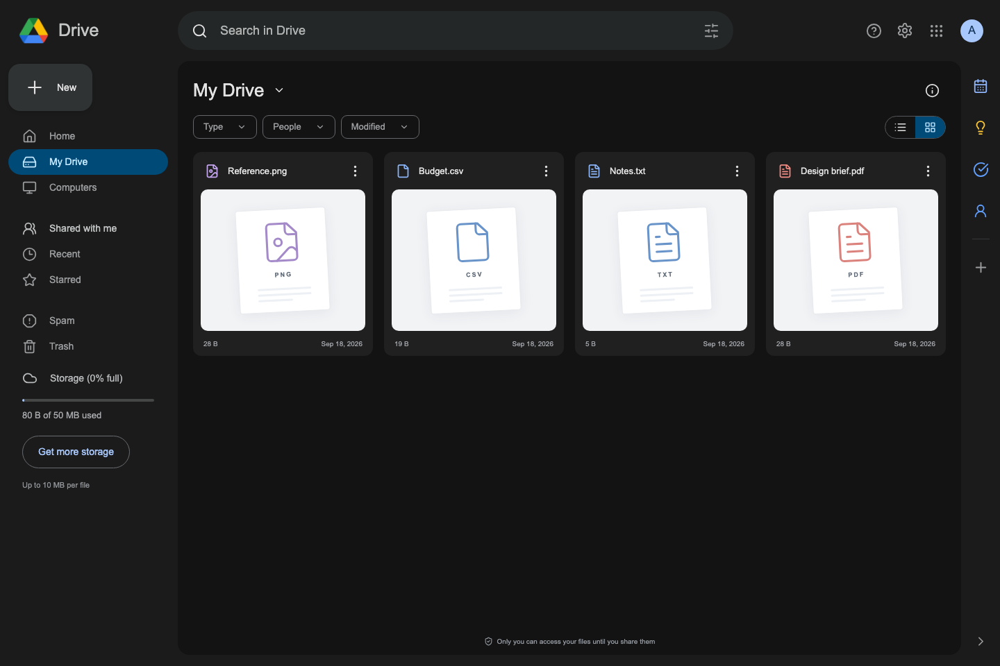

# Drive

[Open the live application](https://google-drive-app-1ses.onrender.com)

A personal file workspace with Google sign-in, private uploads, filename search, and sharing with other users. The dark, responsive interface includes grid and list views, drag-and-drop uploads, progress feedback, and keyboard-accessible dialogs and menus.

Built with TypeScript, React, Vite, Express, and MongoDB. One Node process serves the frontend and API. A storage adapter supports a private local directory or MongoDB GridFS.



_Interface shown with temporary example files. [Mobile view](docs/screenshots/drive-mobile.png)._

## Features

- Google OAuth with server-side sessions and CSRF protection.
- Upload one or several files, with per-file progress and cancellation.
- Download, rename, search, and permanently delete owned files.
- Open images and PDFs in a private preview dialog; browse PDF pages.
- Share with registered Google users as viewers; revoke access at any time.
- Private-by-default files, checked on every metadata and download request.
- Storage quotas, bounded streaming, failed-upload cleanup, and restart recovery.
- Docker Compose for local use and a Render Blueprint for hosting.

Navigation and tools outside this feature set are visibly unavailable. Images (JPEG, PNG, GIF, WebP and AVIF) have real thumbnails and an in-app viewer. PDFs open in a paginated viewer. Other formats show a download fallback. Folders, trash/restore, stars, Google integrations, and offline access are not implemented. Non-image cards use file-type artwork. The project is independent and is not affiliated with Google.

## Run locally

Requirements: Node.js 22.12 or newer, npm, a MongoDB instance, and a Google OAuth web client. Docker Desktop is optional unless using Compose. MongoDB Atlas works with either storage backend.

```sh
npm ci
cp -n .env.example .env
openssl rand -hex 32
```

Set `SESSION_SECRET` to the generated value. Fill in `MONGODB_URI`, `GOOGLE_CLIENT_ID`, and `GOOGLE_CLIENT_SECRET` in `.env`. Never commit this file.

For the Vite development server, use:

```dotenv
APP_ORIGIN=http://localhost:5173
STORAGE_BACKEND=local
```

Add `http://localhost:5173/auth/google/callback` to the Google client's authorized redirect URIs, then run:

```sh
npm run dev
```

Open [localhost:5173](http://localhost:5173). Vite proxies `/api` and `/auth` to Express on port 3000. No Google Drive API permissions are needed; users authenticate with their basic Google identity.

To run the compiled app directly:

```sh
npm run build
npm start
```

Set `APP_ORIGIN=http://localhost:3000` and register the matching Google callback URI first. The compiled frontend and API are both served on port 3000.

## Run with Docker

Fill `.env` first and register `http://localhost:3000/auth/google/callback` with Google.

```sh
docker compose up --build
```

Open [localhost:3000](http://localhost:3000). Compose starts MongoDB on its private network and uses named volumes for database and file persistence. The local Compose profile overrides `NODE_ENV`, origin, database URL, and storage path; it uses HTTP-compatible cookies for localhost. The same image uses secure cookies in production.

```sh
docker compose down
```

This stops the app while retaining volumes. Do not use `down -v` unless you intend to erase the local data.

## Configuration

| Variable               | Purpose / default                                        |
| ---------------------- | -------------------------------------------------------- |
| `NODE_ENV`             | `development`, `test`, or `production`                   |
| `PORT`                 | HTTP port; default `3000`                                |
| `APP_ORIGIN`           | Exact browser origin; defaults to Render URL when hosted |
| `MONGODB_URI`          | MongoDB connection string; required                      |
| `MONGODB_DB`           | Database name; default `drive`                           |
| `SESSION_SECRET`       | Random session-signing secret of at least 32 characters  |
| `GOOGLE_CLIENT_ID`     | Google OAuth web client ID                               |
| `GOOGLE_CLIENT_SECRET` | Google OAuth web client secret                           |
| `STORAGE_BACKEND`      | `local` or `gridfs`; applies to new uploads              |
| `UPLOAD_DIR`           | Private local storage root; default `./uploads`          |
| `MAX_FILE_BYTES`       | Default 10 MiB: `10485760`                               |
| `USER_QUOTA_BYTES`     | Default 50 MiB: `52428800`                               |
| `TOTAL_QUOTA_BYTES`    | Default 300 MiB: `314572800`                             |

Production startup requires an HTTPS origin and Google credentials. The application never provides a production login bypass. Test identities exist only in an isolated test fixture, outside the production build.

File limits are enforced independently of the client. At most 100 files per user and 1,000 files overall are allowed. An in-progress upload reserves the maximum file size, so uploads can temporarily require more free capacity than the final file size. Concurrent reservations are atomic.

## Deploy on Render

See [the deployment guide](docs/DEPLOYMENT.md) for Google OAuth, Atlas network access, Render setup, and smoke checks. `render.yaml` provisions a single free Docker web service configured for GridFS. Set provider credentials in Render's environment settings.

Render's free filesystem is ephemeral: **use GridFS for persistent hosted uploads**. Free instances sleep when idle, so the first request can be slower. Atlas Free has a small shared data/index allowance; the app's byte and count limits leave headroom but do not replace monitoring actual database usage.

A live URL is recorded only after a deployment has been verified. There is no placeholder live link.

## Quality checks

```sh
npm run typecheck
npm test
npm run build
npx playwright install chromium
npm run test:e2e
npm run format:check
```

Integration tests start a real temporary MongoDB process using `mongodb-memory-server`; the first run downloads a MongoDB binary. No Atlas credentials are needed. Browser tests run the built app against a separate temporary database with two isolated users. They do not automate the Google sign-in provider.

The integration suite covers both storage adapters, exact download bytes, ownership, sharing and revocation, literal search, validation, quotas under concurrency, size boundaries, and recovery after storage failures. Browser tests cover the complete user workflow, mobile layout, keyboard menus, real image decoding, PDF page navigation, unsupported and corrupt content, and preview access after sharing and revocation.

## Project structure

```text
apps/api/src/       Express app, auth, database, storage, file lifecycle
apps/api/test/      API and storage integration tests
apps/web/src/       React interface, API client, dialogs, styles
packages/shared/   Validation schemas and public response types
e2e/               Browser workflow tests
scripts/           Isolated browser-test server
docs/              Architecture, API, and deployment guides
```

Read [architecture](docs/ARCHITECTURE.md) for the data flow and tradeoffs, [API reference](docs/API.md) for request/response behavior, and [security](docs/SECURITY.md) for the trust boundaries and operating limits.

## Project tracking

Beads (`bd`) tracks tasks, dependencies, and issues. Run `bd ready` to find available work, `bd show <id>` for context, and `bd stats` for project status. Its local Dolt database is independent of the application database. Do not commit runtime files, environment secrets, or uploaded content.
