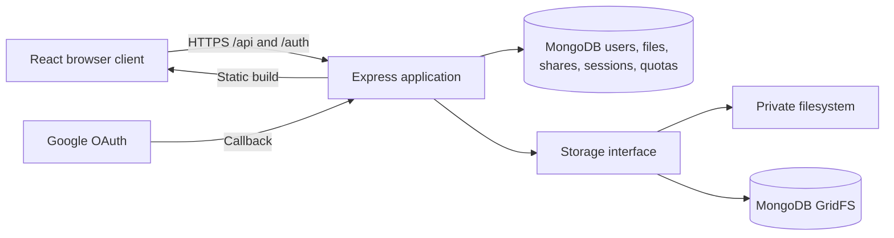
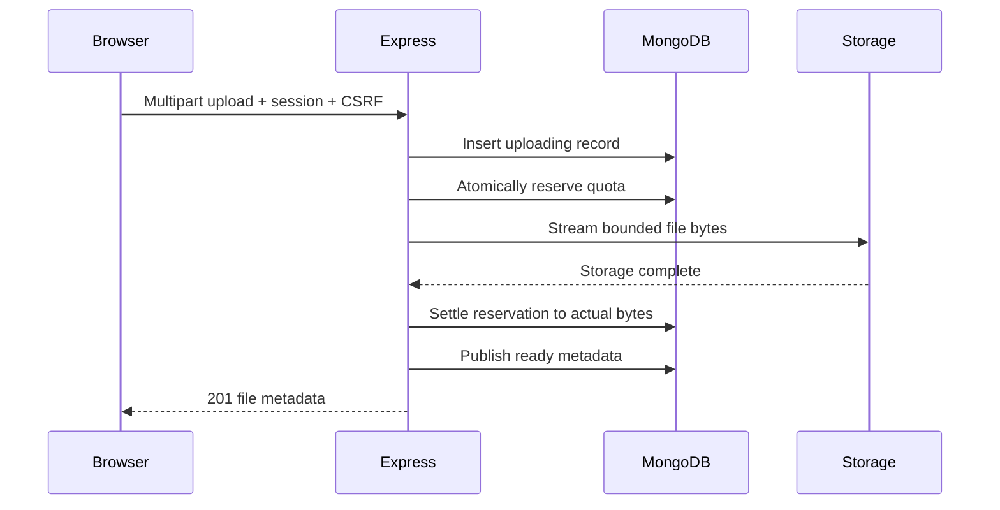

# Architecture

## System overview

Drive is a single-service application. React handles interaction, Express owns business rules, and MongoDB persists application state. Production traffic uses one origin, which simplifies cookies and avoids cross-origin authentication configuration.

The browser has no database credentials and cannot choose a file's owner or storage path. Object IDs identify files but never grant access by themselves.

## Modules and boundaries

- `app.ts` wires middleware and HTTP routes. Public response shapes omit internal storage details.
- `auth.ts` configures Google OAuth and session serialization.
- `files.ts` controls access, upload parsing, quota accounting, deletion, and recovery.
- `storage.ts` implements streaming reads/writes and idempotent cleanup for local and GridFS storage.
- `database.ts` defines document types and initializes indexes.
- Shared Zod schemas validate public request bodies on the server and selected form inputs in the browser.

The MongoDB native driver provides both metadata access and GridFS without an additional ORM. React Query owns server-state fetching and invalidation; React state holds dialogs, view selection, and upload progress.

## Authentication

1. The browser navigates to `/auth/google`.
2. Passport creates an OAuth state value in a MongoDB-backed session and redirects to Google.
3. Google redirects to the configured callback. Passport validates the state and retrieves the identity profile.
4. The app requires a verified email and upserts the account by Google's stable identifier. It does not merge unrelated identities based only on email.
5. Passport establishes a login session. Only the internal user ID is serialized; subsequent requests load the user from MongoDB.
6. The browser receives an HttpOnly session cookie. Production uses Secure and SameSite=Lax.

No Google access or refresh tokens are retained. The app stores its own files and does not access a user's Google Drive. Sessions expire after seven days; logout destroys the server-side session and clears the cookie.

## Upload lifecycle

A file transitions through `uploading`, `ready`, and `deleting`. Only `ready` files appear in lists or can be downloaded. Local uploads write to a generated `.part` path, then rename to the final opaque path; GridFS uses the file ID as its storage ID.

A shared quota document contains global totals, per-user totals, and allocations keyed by file ID. Reserving capacity updates all relevant counters atomically in one document. This avoids introducing distributed transactions around GridFS, which does not support a transaction spanning an upload. File-count limits bound active allocations for this small application.

Reservations use the configured maximum file size, then shrink to the actual size. This is intentionally conservative: the client cannot lie about the file size, and concurrent uploads cannot overbook capacity. It can reject a small upload when less than one maximum-size reservation remains.

The request consumes one multipart file. Other fields and additional files are rejected. The browser queues multiple files and sends one request at a time. Network-transfer progress reaches 100% before server completion, so the interface displays “Finishing…” until the API confirms storage.

## Failures and recovery

The metadata insert precedes reservation so every allocation has a recoverable record. Failures mark the record `deleting`; cleanup removes bytes, shares, and quota allocation before removing metadata. Each step can be retried. Quota release compares the current allocation, preventing double release.

A deletion becomes inaccessible before physical cleanup begins. If storage cleanup fails, the HTTP operation reports an error and the recovery pass retries it. No new download is authorized while the file is pending deletion. Already-open download streams cannot be retracted.

Recovery runs on startup and once per minute. Upload records older than ten minutes become cleanup candidates, giving active requests a grace period. An abrupt process stop can leave temporary bytes until this recovery window expires. The HTTP server has a two-minute request timeout. Monitor repeated cleanup failures rather than silently ignoring them.

## Downloads, names, and sharing

Downloads recheck the current owner/share relationship and stream from the recorded backend. Files are delivered as attachments with `application/octet-stream` and `nosniff`; uploaded HTML is never executed under the application's origin.

Renaming updates only display metadata. Physical storage uses generated identifiers, so filename changes do not move bytes. Duplicate names are allowed, and search matches literal case-insensitive substrings within the current owned/shared scope.

A share links a file and an existing recipient account. A unique compound index makes repeated sharing idempotent. Recipients can view metadata and download; only owners rename, delete, list recipients, and change sharing. Deleting a file removes its share records. Revocation affects subsequent authorization checks, not copies already downloaded.

## Data and indexes

| Collection                         | Important fields / indexes                                                                         |
| ---------------------------------- | -------------------------------------------------------------------------------------------------- |
| `users`                            | Unique `googleId`, unique normalized `email`, name, timestamps                                     |
| `files`                            | Owner, name, MIME hint, bytes, backend, state, timestamps; owner/state/date and state/date indexes |
| `shares`                           | File, recipient, created time; unique file/recipient and recipient lookup indexes                  |
| `sessions`                         | MongoDB-backed session data with TTL expiration                                                    |
| `quotas`                           | Global/per-user byte and count totals; per-file allocations                                        |
| `content.files` / `content.chunks` | GridFS content metadata and binary chunks                                                          |

MongoDB stores MIME information supplied by the uploader as a hint, not as a trusted security assertion. Download delivery does not rely on it. API file lists return 25 results per page, newest first with an ID tie-breaker.

## Deployment and deliberate limits

One Docker image contains the Express server and built React assets. Render runs that image; MongoDB Atlas persists data. Local Docker Compose supplies MongoDB and a persistent filesystem volume. Switching `STORAGE_BACKEND` affects new uploads only; existing local files still require their original disk. Moving a local installation to GridFS is not an automatic migration.

This is designed for a small personal service with one application instance. In-memory request limiting and the single quota ledger are deliberate simplicity choices. Larger deployments should use shared rate-limit storage, scalable quota accounting, object storage, direct uploads, a durable cleanup worker, and content scanning. These are extensions, not prerequisites for the current scope.
